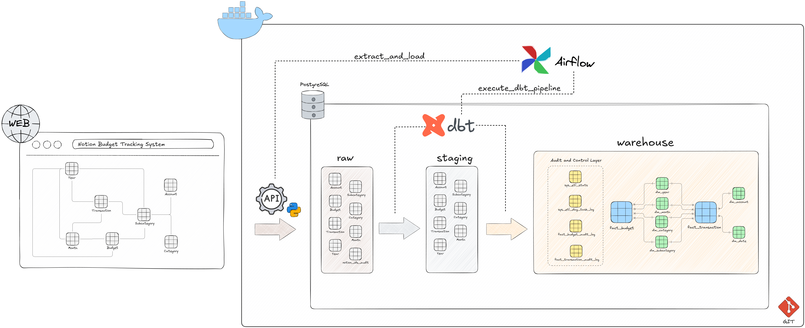

# Notion Budget Manager: End-to-End ELT Pipeline

## Project Objective

This is a personal portfolio project built to solidify my 1.5 years of experience in Data Warehousing and to actively expand my skillset into modern Data Engineering. 

The goal of this project is to extract my personal budgeting and expense data from Notion, load it into a PostgreSQL data warehouse, transform it into a Kimball dimensional model, and orchestrate the entire process. 

Instead of taking shortcuts, I used this project as a sandbox to learn and implement production-level concepts like API rate limiting, Incremental Loading, Slowly Changing Dimensions (SCD Type 2), operational logging, and strict Git version control.

## Tech Stack

*   **Source:** Notion API
*   **Ingestion:** Python (Pandas, SQLAlchemy, Requests)
*   **Storage:** PostgreSQL 18
*   **Transformation:** dbt-core (dbt-postgres)
*   **Orchestration:** Apache Airflow 3.1
*   **Infrastructure:** Docker & Docker Compose
*   **Version Control:** Git (Feature branching, documented commit history)
*   **Support:** Google Gemini (Mainly in edge cases, when my superpowers are just not enough 🙂)

## Architecture Overview

The pipeline runs on a fully containerized Docker Compose environment and follows an ELT (Extract, Load, Transform) philosophy:
- **Extract & Load (Python):** Custom Python scripts pull data from 7 different Notion databases. The data is loaded into the raw schema in Postgres.
- **Orchestration (Airflow):** Airflow manages the dependencies, ensuring all 7 extraction scripts succeed before handing off the process to dbt.
- **Transform (dbt):** dbt reads the raw data, cleanses it in a staging layer, tracks historical changes using Snapshots, and builds final Fact and Dimension tables in the warehouse schema.

## Key Technical Challenges & Learnings

Building this project from scratch exposed me to several real-world data engineering hurdles that required architectural pivots:

- **Handling API Limits & "Lazy" Computations**  
    - **The Problem:** Initially, I tried to extract complex "Rollup" fields directly from the Notion API. However, computing these on-the-fly caused Notion's backend to throw 504 Gateway Time-out errors.  
    - **The Solution:** I refactored the Python scripts to drop the computed Rollups entirely. Instead, I perform a "Double-Extract" of the base tables and use dynamic page sizing (page_size: 25 for heavy tables, 100 for light tables) to respect API limits. The relational joins are now handled natively inside the database via dbt.

- **The "Hard Delete" Problem**  
    - **The Problem:** SaaS APIs like Notion easily provide updated rows via a last_edited_time filter, but they do not flag when a row is deleted. This can lead to "ghost" rows in the warehouse.  
    - **The Solution:** I implemented a two-step "ID Audit" strategy in Python. First, the script performs a fast incremental load of new/updated data. Second, it pulls a "skinny" payload of only the current IDs from Notion, loads them into a temporary `notion_ids_audit` table, and runs an atomic NOT EXISTS SQL delete against the raw schema. This prevents having to truncate and reload 100% of the data every run.

- **Enforcing Data Integrity**  
    - **The Problem:** I wanted my final warehouse tables to have the strictness of a traditional relational database, but dbt handles table materializations by dropping and swapping temporary tables (which breaks hardcoded constraints).  
    - **The Solution:** I wrote custom dbt pre_hook and post_hook Jinja macros. These dynamically generate and apply Primary Keys, Foreign Keys, and Unique Indexes directly in PostgreSQL after dbt finishes building the table, ensuring strict referential integrity.

- **Custom ETL Observability & Logging**  
    - **The Problem:** Relying on Airflow text logs is inefficient for auditing data payloads. I wanted to build a native logging system to track pipeline health and work.  
    - **The Solution:** I configured Airflow's on_success_callback to write execution metrics (duration, status) to a `sys_etl_dag_task_log` table. I then passed Airflow's logical_date as a RUN_ID environment variable into both my Python scripts and dbt macros. This allows Python to log extraction counts and dbt to log SCD2 row mutations into a shared `sys_etl_stats` table, tied perfectly together by a single RUN_ID.

## Data Warehouse Structure
The database is divided into three distinct schemas to enforce a clear separation of concerns:
- **raw:** A (almost) direct 1:1 replica of the Notion Databases.

- **staging:** dbt views that cast data types, standardize column naming conventions, add system records, and protect referential integrity.

- **warehouse:** The final presentation layer based on Ralph Kimball's dimensional modeling:
    - **Dimensions (SCD Type 2):** `dim_account`, `dim_category`, `dim_subcategory`, `dim_month`, `dim_year`, and a static `dim_date` seed.
    - **Facts:** `fact_transaction` (transactional type; daily grain) and `fact_budget` (periodic snapshot type; monthly grain, anchored to the end of the period to ensure correct SCD2 dimension joins).
    - **Audit/Stats:** `sys_etl_stats`, `sys_etl_dag_task_log`, and dbt snapshot audit logs.

## How to Run Locally
At the moment, the project isn't ready for others to download and run on their local machines.

## Known Limitations and Future Improvements

As a learning project, I made specific architectural trade-offs that work perfectly for a single-user data volume (thousands of rows) but would need refactoring for a massive enterprise scale (millions of rows):

1. **The ID Audit:**  
   Because the Notion API does not expose a "Deleted Records" endpoint or webhooks for deletions, I implemented a "Skinny ID Audit" to catch hard deletes. While pulling a few thousand IDs works fast, this pattern would cause API rate-limit bottlenecks at an enterprise scale. One elegant alternative would be to mark the deleted records directly in Notion with a flag like "is_deleted", but the system there works a bit complicated and such a solution needs big changes there.

2. **Physical Constraints vs. Logical Tests (dbt):**  
   The jinja macros to enforce hard Primary and Foreign Keys in Postgres is a bit of a overkill. While this guarantees 100% referential integrity, it fights dbt's native "table swap" materialization logic and causes overhead. Unfortunately, I found about how exactly dbt table materialization works after I created the macros, but decided to keep them for now, until I research more thoroughly how to rely etirely on dbt's tests. 

3. **Redundant dimensions**  
    YEAR and MONTH tables were implemented in Notion's budgeting system for a simpler analysis by year and month. In the data warehouse, these are more redundand than helpful, and I realize that.
    Especially after I created the dim_date dimension, they are more redundant than ever. One of my next steps will be to drop them from the architecture.